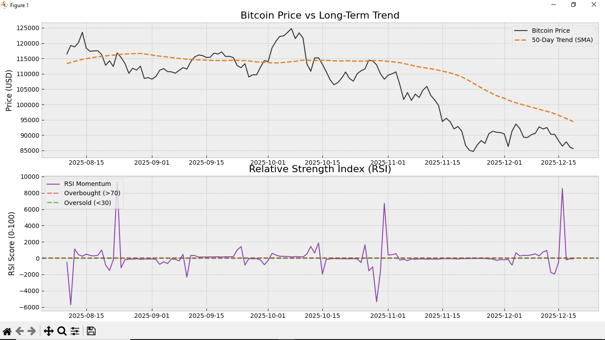

# 📈 Bitcoin Market Sentiment Analyzer


[](https://www.kaggle.com/code/mahmoudsalah7344/bitcoin-analyzer)
## Overview

This is a data analytics project that automates the analysis of Bitcoin (BTC) price trends. It fetches real-time market data, calculates technical indicators (RSI & SMA), and generates a trading recommendation (Buy/Sell/Hold) based on market sentiment.

## 🛠️ Tech Stack

- **Python**: Core programming language.
- **Pandas**: For data manipulation and time-series management.
- **Matplotlib / Seaborn**: For visualizing market trends.
- **CoinGecko API**: Source of live historical market data.

## 📊 Key Features

1.  **Automated ETL Pipeline**: Extracts raw JSON data from the API and transforms it into a structured DataFrame.
2.  **Technical Indicators**:
    - **SMA (50-Day Simple Moving Average)**: Determines the long-term trend.
    - **RSI (Relative Strength Index)**: Identifies Overbought (>70) and Oversold (<30) conditions.
3.  **Algorithmic Decision Engine**: Uses conditional logic to output a clear "Buy," "Sell," or "Hold" signal.

## 🚀 How to Run

1.  Clone the repository:
    ```bash
    git clone https://github.com/Mahmoud455Salah/bitcoin-sentiment-analyzer.git
    ```
2.  Install dependencies:
    ```bash
    pip install requests pandas matplotlib seaborn
    ```
3.  Run the script:
    ```bash
    python bitcoin_analyzer.py
    ```

## 📈 Visuals



## ⚠️ Disclaimer

This project is for educational purposes only and does not constitute financial advice.
